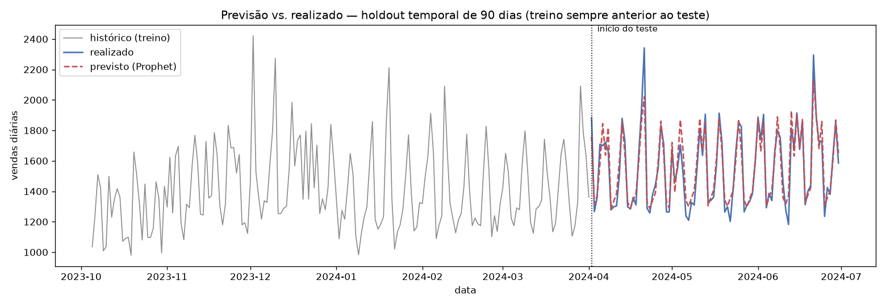
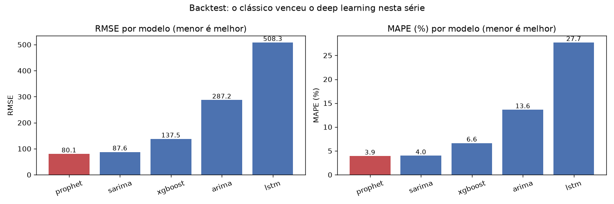

# Sales Demand Forecasting Platform

Plataforma **ponta a ponta** de **previsão de demanda de vendas** (série
temporal diária de varejo): de dados a previsão servida em API, com dashboard
interativo, comparação de modelos clássicos + ML + deep learning, tracking de
experimentos e containerização. Projeto de portfólio para **Cientista de Dados
Pleno**, com foco em rigor de série temporal (backtest sem vazamento de futuro).


> ⚠️ **Sobre os dados.** A série histórica é **sintética**, gerada por
> [`src/data/generate_synthetic.py`](src/data/generate_synthetic.py). A escolha é
> deliberada: o objetivo é a **engenharia ponta a ponta** — backtest com holdout
> temporal, comparação de famílias de modelos, serviço e dashboard — e não a
> descoberta de um sinal novo. Como o gerador compõe tendência e sazonalidade
> explícitas, **as métricas abaixo não são comparáveis a benchmarks de dado real**:
> um MAPE de 3,9% reflete uma série bem-comportada, sem promoções, rupturas ou
> quebras de regime, que são exatamente o que torna previsão de demanda difícil
> na prática.

## Contexto de negócio
Varejo e logística vivem de **planejar demanda**: comprar estoque de menos gera
ruptura e venda perdida; de mais, gera custo de capital e perdas. Prever as
vendas dos próximos dias/semanas com incerteza controlada é o que sustenta
compras, reposição e dimensionamento logístico. Esta plataforma prevê a demanda
diária e serve essa previsão para sistemas de planejamento.

## Stack
Python 3.12 · Pandas/NumPy · statsmodels (ARIMA/SARIMA) · Prophet · XGBoost ·
TensorFlow-CPU (LSTM) · scikit-learn · MLflow · FastAPI · Streamlit · Plotly ·
SQLAlchemy/PostgreSQL · Docker · pytest

## Arquitetura
```
 generate_synthetic ─▶ ETL ─▶ PostgreSQL / parquet
      (série)          │              │
                       ▼              ▼
             Feature Engineering ─▶ Backtest temporal (holdout dos últimos N dias)
             (calendário, lags,       │  Prophet · ARIMA · SARIMA · XGBoost · LSTM
              médias móveis,          │      └─▶ MLflow (MAE/RMSE/MAPE/sMAPE)
              Fourier)                ▼
                              melhor modelo (re-treinado em todo o histórico)
                                      │
                      ┌───────────────┴───────────────┐
                      ▼                                 ▼
                API FastAPI  ◀──── /forecast ────  Dashboard Streamlit
               (/health, /forecast)               (histórico + previsão + métricas)
```
Detalhes e fluxograma em [`reports/ARCHITECTURE.md`](reports/ARCHITECTURE.md).

## Resultados

Backtest com **holdout temporal** (últimos 90 dias como teste; treino sempre
anterior ao teste — sem vazamento de futuro):



| Modelo | MAE | RMSE | MAPE (%) | sMAPE (%) |
|---|---|---|---|---|
| **Prophet** ✅ | **61.0** | **80.1** | **3.9** | **3.9** |
| SARIMA | 64.1 | 87.6 | 4.0 | 4.0 |
| XGBoost | 107.8 | 137.5 | 6.6 | 7.0 |
| ARIMA | 227.4 | 287.2 | 13.6 | 14.6 |
| LSTM | 433.5 | 508.3 | 27.7 | 29.7 |



**Prophet** venceu (menor RMSE, MAPE ~3,9%): modela bem as sazonalidades múltiplas
(semanal + anual) e os regressores promo/holiday. O **SARIMA** ficou logo atrás —
o clássico com sazonalidade semanal + exógenas é competitivo. O **LSTM** univariado
com previsão recursiva de 90 dias acumula erro e fica atrás dos demais neste
cenário (série única, sem exógenas na rede) — ver "melhorias futuras".

O melhor modelo é re-treinado em todo o histórico e salvo para servir na API.
Runs completos versionados no MLflow.

## Como rodar (local)
```bash
python -m venv .venv && source .venv/bin/activate
pip install -r requirements.txt

# 1) série sintética  2) ETL  3) backtest + treino do melhor modelo
python -m src.data.generate_synthetic --days 1277 --seed 42
python -m src.data.etl
python -m src.models.backtest --horizon 90          # use --no-lstm p/ pular o LSTM

# API (http://localhost:8000/docs)
uvicorn app.main:app --reload

# Dashboard (http://localhost:8501) — com a API no ar
streamlit run app/dashboard.py

# Testes
pytest -q
```

### Exemplo de chamada à API
```bash
curl -X POST http://localhost:8000/forecast -H "Content-Type: application/json" \
  -d '{"horizon": 30, "promo_dates": ["2024-07-15", "2024-07-16"]}'
# -> {"model": "...", "horizon": 30, "forecast": [{"date": "...", "forecast": 1234.0, ...}, ...]}
```

## Como rodar (Docker)
```bash
python -m src.models.backtest --horizon 90   # gera models/model.joblib
docker compose up --build                     # Postgres + API (8000) + dashboard (8501)
```

## Estrutura
```
data/         série bruta (CSV) e processada (parquet, SQLite)
src/data/     geração da série + ETL
src/features/ features de calendário/lags/Fourier + janelas do LSTM
src/models/   Prophet, ARIMA/SARIMA, XGBoost, LSTM, métricas e backtest
app/          API (FastAPI) e dashboard (Streamlit)
notebooks/    EDA (01-eda.ipynb)
models/       melhor modelo salvo (+ metadados)
reports/      métricas, arquitetura e relatório técnico
tests/        testes automatizados (pytest)
```

## Decisões de projeto (trade-offs)
- **Backtest temporal, não split aleatório**: em série temporal, embaralhar
  vazaria futuro no treino. O teste é sempre o período mais recente.
- **Múltiplas métricas** (MAE, RMSE, MAPE, sMAPE): cada uma revela um aspecto do
  erro; a escolha do melhor modelo usa RMSE (penaliza erros grandes de estoque).
- **Cinco famílias de modelos**: clássicos (ARIMA/SARIMA) dão baseline
  interpretável; Prophet lida bem com sazonalidades múltiplas e feriados;
  XGBoost explora features/exógenas; LSTM captura padrões não-lineares. Comparar
  é parte do método.
- **Regressores exógenos** (promo/holiday) conhecidos no futuro entram em
  SARIMAX, Prophet e XGBoost — refletem o planejamento real do negócio.
- **Previsão recursiva** (XGBoost/LSTM): honesta para múltiplos passos, sem usar
  valores futuros reais.
- **PostgreSQL com fallback SQLite**; **MLflow em backend SQLite**; configs por
  env var — mesma base MLOps dos projetos anteriores.

## Melhorias futuras
- Intervalos de predição (incerteza) e calibração.
- `auto-arima`/tuning de hiperparâmetros e seleção de ordens por AIC.
- Modelos multi-série (por loja/SKU) e hierárquicos.
- Monitoramento de drift + re-treino agendado (Etapa 10).

## Status das etapas
- [x] 1 — Geração de dados sintéticos
- [x] 2 — ETL + carga no banco
- [x] 3 — EDA
- [x] 4 — Feature Engineering
- [x] 5 — Modelos, backtest e comparação (MLflow)
- [x] 6 — API FastAPI
- [x] 7 — Dashboard Streamlit
- [x] 8 — Docker + Compose
- [x] 9 — Testes, CI, logs e documentação
